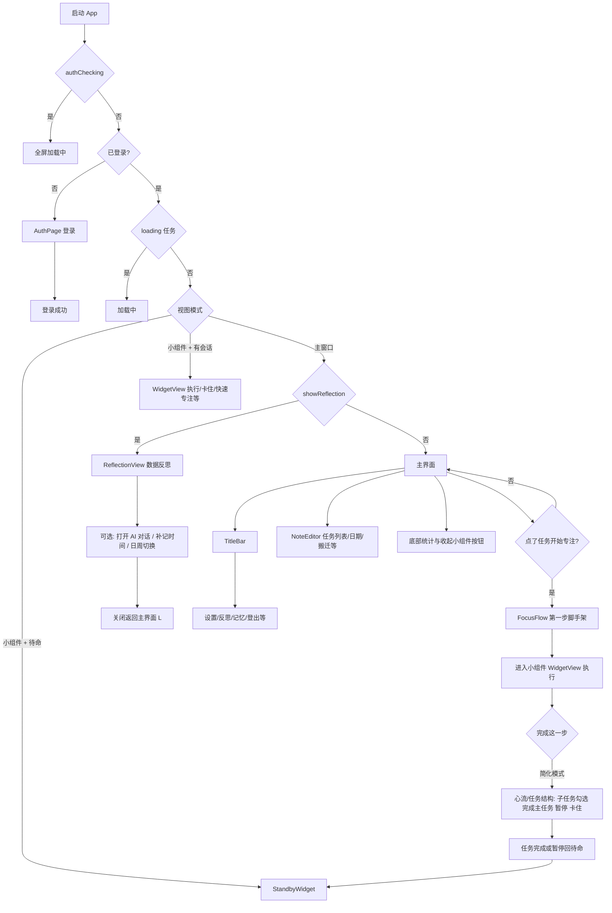

<!-- Generated by SpecStory, Markdown v2.1.0 -->

# 2026-04-04 07:38:13Z

<!-- cursoride Session c1854325-ec48-4b56-8c87-ea6dd4db9a7d (2026-04-04 07:38:13Z) -->

_**User**_

我需要了解这个 Electron 任务管理原型的完整用户功能流程。请帮我梳理以下内容：

1. 用户从打开 App 到完成一天任务的完整流程（主线流程）
2. 每个主要界面/视图有哪些功能
3. 哪些是核心功能，哪些是辅助功能

请查看以下文件来理解：
- src/renderer/src/App.tsx（主界面和视图切换逻辑）
- src/renderer/src/components/TitleBar.tsx（标题栏功能）
- src/renderer/src/components/FocusFlow.tsx（专注流程/脚手架）
- src/renderer/src/components/WidgetView.tsx（小组件/计时视图）
- src/renderer/src/components/StandbyWidget.tsx（待命小组件）
- src/renderer/src/components/ReflectionView.tsx（反思视图）
- src/renderer/src/components/ReflectionChat.tsx（反思对话）
- src/renderer/src/components/ManualTimeEntry.tsx（手动补记）
- src/renderer/src/hooks/useFocusSession.ts（专注会话逻辑）

请返回：
1. 完整的用户流程图（从登录到日终反思）
2. 每个界面包含的功能列表
3. 核心功能 vs 辅助功能的分类

---

_**Agent (composer-2-fast)**_

正在读取所列文件并搜索登录/路由相关逻辑，以梳理完整用户流程。

_**Agent (composer-2-fast)**_

<tool-use data-tool-type="read" data-tool-name="read_file_v2">

Tool use: **read_file_v2** • Read file: d:\workspace\testwindows\src\renderer\src\App.tsx

</tool-use>

<tool-use data-tool-type="read" data-tool-name="read_file_v2">

Tool use: **read_file_v2**

</tool-use>

_**Agent (composer-2-fast)**_

<tool-use data-tool-type="read" data-tool-name="read_file_v2">

Tool use: **read_file_v2** • Read file: d:\workspace\testwindows\src\renderer\src\components\TitleBar.tsx

</tool-use>

<tool-use data-tool-type="read" data-tool-name="read_file_v2">

Tool use: **read_file_v2**

</tool-use>

_**Agent (composer-2-fast)**_

<tool-use data-tool-type="read" data-tool-name="read_file_v2">

Tool use: **read_file_v2** • Read file: d:\workspace\testwindows\src\renderer\src\components\FocusFlow.tsx

</tool-use>

<tool-use data-tool-type="read" data-tool-name="read_file_v2">

Tool use: **read_file_v2**

</tool-use>

_**Agent (composer-2-fast)**_

<tool-use data-tool-type="read" data-tool-name="read_file_v2">

Tool use: **read_file_v2** • Read file: d:\workspace\testwindows\src\renderer\src\components\WidgetView.tsx

</tool-use>

<tool-use data-tool-type="read" data-tool-name="read_file_v2">

Tool use: **read_file_v2**

</tool-use>

_**Agent (composer-2-fast)**_

<tool-use data-tool-type="read" data-tool-name="read_file_v2">

Tool use: **read_file_v2** • Read file: d:\workspace\testwindows\src\renderer\src\components\StandbyWidget.tsx

</tool-use>

<tool-use data-tool-type="read" data-tool-name="read_file_v2">

Tool use: **read_file_v2**

</tool-use>

_**Agent (composer-2-fast)**_

<tool-use data-tool-type="read" data-tool-name="read_file_v2">

Tool use: **read_file_v2** • Read file: d:\workspace\testwindows\src\renderer\src\components\ReflectionView.tsx

</tool-use>

<tool-use data-tool-type="read" data-tool-name="read_file_v2">

Tool use: **read_file_v2**

</tool-use>

_**Agent (composer-2-fast)**_

<tool-use data-tool-type="read" data-tool-name="read_file_v2">

Tool use: **read_file_v2** • Read file: d:\workspace\testwindows\src\renderer\src\components\ReflectionChat.tsx

</tool-use>

<tool-use data-tool-type="read" data-tool-name="read_file_v2">

Tool use: **read_file_v2**

</tool-use>

_**Agent (composer-2-fast)**_

<tool-use data-tool-type="read" data-tool-name="read_file_v2">

Tool use: **read_file_v2** • Read file: d:\workspace\testwindows\src\renderer\src\components\ManualTimeEntry.tsx

</tool-use>

<tool-use data-tool-type="read" data-tool-name="read_file_v2">

Tool use: **read_file_v2**

</tool-use>

_**Agent (composer-2-fast)**_

<tool-use data-tool-type="read" data-tool-name="read_file_v2">

Tool use: **read_file_v2** • Read file: d:\workspace\testwindows\src\renderer\src\hooks\useFocusSession.ts

</tool-use>

<tool-use data-tool-type="read" data-tool-name="read_file_v2">

Tool use: **read_file_v2**

</tool-use>

_**Agent (composer-2-fast)**_

<think>

Thought Process

**Reviewing auth flow**

I'm summarizing the auth flow from App.tsx, noting the key steps from auth checking to potential standby widget mode. I'm tracing the auth flow from App.tsx to understand how widget mode and reflection views are triggered. I'm checking if NoteEditor has quick focus functionality wired up through handleQuickFocus from the hook. 
</think>

_**Agent (composer-2-fast)**_

以下为基于你列出的文件及 `App.tsx` 中的视图分支整理出的说明（主界面任务编辑在 `NoteEditor`，虽未单独列出，但主线依赖它）。

---

## 1. 完整用户流程图（从登录到日终反思）

当前代码里有两处**功能开关**，会改变「理论上的完整版」和「你现在跑到的版本」：

- `FocusFlow.tsx`：`ENABLE_TASK_UNDERSTANDING = false` → **不做**「任务理解」问答，**只做**「第一步微动作」脚手架。  
- `WidgetView.tsx`：`ENABLE_STEP_BY_STEP = false` → 完成第一步后**不进入**多步 relay 接力，而是**直接进入**「心流 / 任务结构」视图。

**首次启动特例**（`App.tsx`）：若主进程标记为首次初始化、非小组件、且无已保存专注会话，会**自动进入小组件待命模式**，引导用户从小窗口开始。

---

## 2. 各界面/视图功能列表

### 登录与全局

| 区域 | 功能 |
|------|------|
| **AuthPage**（未登录时全屏） | 登录成功回调后写入 `currentUser`，进入主流程。 |
| **启动加载** | `authChecking` / `loading` 时全屏转圈。 |
| **追踪** | `tracker.init()`、`app.launched`；退出登录 `auth.logout`。 |

### 主窗口：`TitleBar.tsx`

- 左侧：标题「我的任务」、未完成数量角标。  
- 每日反思入口（打开 `ReflectionView`）。  
- 设置菜单：个人资料、AI 配置、AI 记忆、退出登录（资料/记忆有小圆点提示）。  
- 窗口：最小化、收起为桌面小组件、退出应用。  
- 可拖动区域（`drag-region`）。

### 主窗口：`NoteEditor`（`App.tsx` 挂载，未单独读文件）

从 `App.tsx` 可知：**任务增删改、日期导航、搬迁横幅、点击任务触发专注、恢复暂停、预取 AI、新建并聚焦**等都在此。

### 主窗口：底部与弹层（`App.tsx`）

- 「收起为桌面小组件」（仅今天且有未完成时突出显示）。  
- 完成进度文案、进度条、「清除已完成」。  
- **FocusFlow**：点击任务后的覆盖层（见下）。  
- **AISettings / ProfileSettings / MemoryPanel**。  
- **QuickFocusEndDialog**：快速专注结束后的确认（与 `useFocusSession` 中 `quickFocusEnd` 配合）。

### FocusFlow（脚手架）

- **当前默认**：仅 **micro_action**（第一步具体动作）；**understanding** 因 `ENABLE_TASK_UNDERSTANDING` 关闭而未启用。  
- 展示任务标题、备注、子任务标签；AI 生成「第一步」芯片或兜底；可手写第一步、点芯片、或「跳过直接开始」。  
- 确认后 `onStart` → `useFocusSession.handleStartMicro` → 进入小组件并 `enterWidget()`。

### StandbyWidget（待命小组件）

- 任务下拉选择（暂停任务优先展示）、**开始** / **继续**（暂停恢复）。  
- 内嵌「第一步」面板：与 FocusFlow 类似的输入 + AI 芯片 + 跳过。  
- **快速添加任务**、下拉中删除任务、**展开主界面**。  
- 窗口高度随下拉/面板变化 `resizeWidget`。

### WidgetView（执行小组件）

- **无 session**：旧版 `LegacyWidget`（任务 chip、勾选完成、展开）。  
- **快速专注** `isQuickFocus`：`QuickFocusWidget`（计时、「做完了」「退出」）。  
- **有 session 且 `ENABLE_STEP_BY_STEP === false`（当前）**：  
  - 非心流：第一步执行条（任务名、当前微动作、计时、**暂停 / 完成这一步 / 卡住了**）。  
  - **完成这一步** → `handleMicroComplete` 将 **`isFlowMode: true`**，进入**任务结构视图**（主任务名、可选 `firstStepHint`、子任务 checkbox、**完成主任务 / 暂停 / 卡住了**）。  
  - 子任务**全部勾选**会触发会话结束逻辑并完成主任务（见 `useFocusSession`）。  
- **卡住**：`stuck_a`（描述困难、常见原因、Reflect）→ `stuck_b`（AI 反思文案、绕路建议、👍👎、继续任务）；会写 MemoryStore、埋点。  
- **`ENABLE_STEP_BY_STEP === true` 时**才会出现 **relay** 多步接力、心流条上的逐步完成等（当前默认关闭，相关分支在文件中保留）。

### ReflectionView（数据反思）

- **日/周**切换；**日期**前后导航、日历选日、「今天/本周」快捷。  
- **日视图**：完成率圆环（今天）、指标卡片、任务用时条形图、电脑活动分布（节奏曲线 + 交互热力图）、今日未执行任务列表、`ManualTimeEntry`。  
- **周视图**：`WeekView` 聚合图表。  
- **AI 浮标**：打开侧边栏对话；窗口加宽；**可拖拽分隔条**调聊天宽度。  
- **关闭**：若有对话会 `triggerEnd` 再关（保存记忆等）。  
- 加载 tracker 事件、活跃度、任务；构建 AI `systemPrompt`（含记忆上下文）。

### ReflectionChat

- 流式对话、`systemPrompt` 初始化首条 AI；**图表引用** `【chart:xxx】` 跳转高亮。  
- 聊天记录持久化、**结束反思**时抽取记忆写入 MemoryStore；`onComplete` 埋点等。

### ManualTimeEntry（反思页内）

- 收起/展开；列出**无专注记录**的任务；勾选并选时间段**补记**；可**新建任务**并补记；写入 `appendTrackerEvents` + 更新任务完成状态。

### useFocusSession（状态机摘要）

- 会话写入 `localStorage`（`focusSession` / `focusSessionId`）。  
- 主界面 **FocusFlow 确认** 与 **待命开始** 都会 `session.started`、`exec.micro_started`，并可选写入 **firstSteps** 到 MemoryStore。  
- **微任务完成**：简化模式下切 **心流 + 任务结构**（非 relay）。  
- **暂停**：任务上挂 `pausedSession`，回待命。  
- **恢复**：从快照恢复会话并 `enterWidget()`。  
- **完成任务**：更新任务完成、埋点 `session.ended` / `macro_completed`，**默认回待命** `setIsStandbyMode(true)`。  
- **快速专注**：`isQuickFocus` 会话；结束弹出 `QuickFocusEndDialog` 补标题或默认「专注时段」。  
- **Widget 勾选任务**：`handleWidgetToggle` 切换完成状态。

---

## 3. 核心功能 vs 辅助功能

**核心（没有它们，「任务 + 一天闭环」不完整）**

- **登录**（`AuthPage` + `authGetUser`）。  
- **按日任务列表与持久化**（`NoteEditor` + `loadTasks` / `saveTasks`）。  
- **专注会话主线**：选任务 → **第一步**（FocusFlow 或 Standby 内嵌）→ **WidgetView 计时与完成/暂停** → **任务完成或暂停**（`useFocusSession`）。  
- **小组件模式**：待命 ↔ 执行 ↔ 展开主窗口（`useWidgetMode` + `StandbyWidget` / `WidgetView`）。  
- **标题栏窗口控制**（最小化、退出、收起小组件）。

**偏核心但可降级（无 AI 仍可用大段流程）**

- **卡住流程 UI**（`stuck_a` / `stuck_b`）：无 AI 时部分文案/芯片可能弱，但界面路径仍在。  
- **子任务**：在任务结构与勾选完成中起作用。  
- **搬迁任务**（`carryOverGroups`）、**清除已完成**、**日期导航**：强相关「整理一天任务」，但不算「单次专注」的最小闭环。

**辅助 / 增强**

- **AI**：FocusFlow/Standby 的第一步建议、卡住时的生成内容、反思对话、`ReflectionChat` 记忆抽取、系统 Prompt 里的数据分析。  
- **AI 配置、个人资料、Memory 面板**：设置与长期记忆，非单次完成任务必需。  
- **ReflectionView + ReflectionChat**：日/周复盘、图表、生产力指标；**ManualTimeEntry**：补记 tracker；均属**复盘与数据修正**。  
- **快速专注**（`isQuickFocus`）：无绑定任务的计时块，偏快捷入口。  
- **LegacyWidget**（无 session）：兼容旧交互。  
- **Feature 开关**：`ENABLE_TASK_UNDERSTANDING`、`ENABLE_STEP_BY_STEP` 控制「更重」的认知与多步接力，当前为简化路径。

---

如需把 **NoteEditor** 里「新建任务、子任务、优先级、备注」等逐条列成清单，可以说一下，我可以只读该文件再补一版「主界面字段级功能表」。
