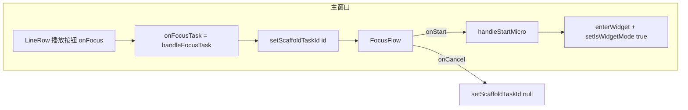

<!-- Generated by SpecStory, Markdown v2.1.0 -->

# 2026-04-04 07:42:31Z

<!-- cursoride Session 946aee2d-9389-44da-a078-9c84c12fcf0b (2026-04-04 07:42:31Z) -->

_**User**_

我需要了解从主窗口点击任务"开始"按钮的完整代码路径，以便将其改为"自动收起为小组件 + 预选该任务"。

请查看以下文件并返回：

1. `src/renderer/src/App.tsx` 中：
   - `scaffoldTaskId` 状态和 `setScaffoldTaskId` 的使用方式
   - `FocusFlow` 组件的挂载位置和 props
   - 任务列表中点击"开始"按钮触发的回调链
   - `enterWidget()` 是如何被调用的
   - `useWidgetMode` hook 提供了哪些方法

2. `src/renderer/src/components/FocusFlow.tsx` 中：
   - `onStart` 回调的参数和调用方式
   - `onCancel` 的作用

3. `src/renderer/src/hooks/useFocusSession.ts` 中：
   - `handleStartMicro` 函数的签名和主要逻辑（前 30 行）
   - 它是如何调用 `enterWidget` 的

4. `src/renderer/src/components/StandbyWidget.tsx` 中：
   - 如何预选一个任务（`selectedTaskId` 状态）
   - 是否有从外部设置预选任务的方式
   - "开始"按钮触发的回调

请返回这些关键代码片段和它们之间的调用关系。

---

_**Agent (composer-2-fast)**_


正在读取并搜索这些文件以梳理完整调用链。


_**Agent (composer-2-fast)**_

<tool-use data-tool-type="read" data-tool-name="read_file_v2">
<details><summary>Tool use: **read_file_v2** • Read file: d:\workspace\testwindows\src\renderer\src\App.tsx</summary>

</details>
</tool-use>

<tool-use data-tool-type="read" data-tool-name="read_file_v2"><details>
<summary>Tool use: **read_file_v2**</summary>

</details></tool-use>

_**Agent (composer-2-fast)**_

<tool-use data-tool-type="read" data-tool-name="read_file_v2">
<details><summary>Tool use: **read_file_v2** • Read file: d:\workspace\testwindows\src\renderer\src\components\FocusFlow.tsx</summary>

</details>
</tool-use>

<tool-use data-tool-type="read" data-tool-name="read_file_v2"><details>
<summary>Tool use: **read_file_v2**</summary>

</details></tool-use>

_**Agent (composer-2-fast)**_

<tool-use data-tool-type="read" data-tool-name="read_file_v2">
<details><summary>Tool use: **read_file_v2** • Read file: d:\workspace\testwindows\src\renderer\src\hooks\useFocusSession.ts</summary>

</details>
</tool-use>

<tool-use data-tool-type="read" data-tool-name="read_file_v2"><details>
<summary>Tool use: **read_file_v2**</summary>

</details></tool-use>

_**Agent (composer-2-fast)**_

<tool-use data-tool-type="read" data-tool-name="read_file_v2">
<details><summary>Tool use: **read_file_v2** • Read file: d:\workspace\testwindows\src\renderer\src\components\StandbyWidget.tsx</summary>

</details>
</tool-use>

<tool-use data-tool-type="read" data-tool-name="read_file_v2"><details>
<summary>Tool use: **read_file_v2**</summary>

</details></tool-use>

_**Agent (composer-2-fast)**_


正在确认 `NoteEditor` 中任务“开始”按钮如何调用 `onFocusTask`。


_**Agent (composer-2-fast)**_

<tool-use data-tool-type="unknown" data-tool-name="ripgrep_raw_search">
<details>
<summary>Tool use: **ripgrep_raw_search**</summary>


Parameters:

```json
{
  "caseInsensitive": false,
  "glob": "**/NoteEditor*",
  "path": "d:\\workspace\\testwindows\\src\\renderer\\src\\components",
  "pattern": "onFocusTask|handleFocusTask|开始"
}
```
Additional data:

```json
{
  "isPruned": true,
  "outputMode": "content",
  "path": "d:\\workspace\\testwindows\\src\\renderer\\src\\components",
  "pattern": "onFocusTask|handleFocusTask|开始",
  "topFiles": [
    {
      "matchCount": 10,
      "uri": "src\\renderer\\src\\components\\NoteEditor.tsx"
    }
  ],
  "totalFiles": 1,
  "totalMatches": 10
}
```
Status: **completed**


</details>
</tool-use>

<tool-use data-tool-type="unknown" data-tool-name="ripgrep_raw_search"><details>
<summary>Tool use: **ripgrep_raw_search**</summary>

</details></tool-use>

_**Agent (composer-2-fast)**_

<tool-use data-tool-type="read" data-tool-name="read_file_v2">
<details><summary>Tool use: **read_file_v2** • Read file: d:\workspace\testwindows\src\renderer\src\hooks\useWidgetMode.ts</summary>

</details>
</tool-use>

<tool-use data-tool-type="read" data-tool-name="read_file_v2"><details>
<summary>Tool use: **read_file_v2**</summary>

</details></tool-use>

_**Agent (composer-2-fast)**_


_**Agent (composer-2-fast)**_

<tool-use data-tool-type="read" data-tool-name="read_file_v2">
<details><summary>Tool use: **read_file_v2** • Read file: d:\workspace\testwindows\src\renderer\src\components\NoteEditor.tsx</summary>

</details>
</tool-use>

<tool-use data-tool-type="read" data-tool-name="read_file_v2"><details>
<summary>Tool use: **read_file_v2**</summary>

</details></tool-use>

_**Agent (composer-2-fast)**_


_**Agent (composer-2-fast)**_

<tool-use data-tool-type="read" data-tool-name="read_file_v2">
<details><summary>Tool use: **read_file_v2** • Read file: d:\workspace\testwindows\src\renderer\src\components\NoteEditor.tsx</summary>

</details>
</tool-use>

<tool-use data-tool-type="read" data-tool-name="read_file_v2"><details>
<summary>Tool use: **read_file_v2**</summary>

</details></tool-use>

_**Agent (composer-2-fast)**_

<think><details><summary>Thought Process</summary>
**Aligning UI labels**

I'm aligning the UI labels to use '' consistently across the main window task row. </details></think>

_**Agent (composer-2-fast)**_


下面是按你列出的文件整理的**代码路径**和**调用关系**（主窗口任务行右侧是绿色播放按钮，`title` 为「专注此任务」，点击即进入 FocusFlow；界面上的「开始」文字主要出现在 `FocusFlow` 与 `StandbyWidget` 里）。

---

## 1. `App.tsx`

### `scaffoldTaskId` / `setScaffoldTaskId`

状态实际定义在 `useFocusSession` 里；`App` 用 `focusSession.scaffoldTaskId` 推出当前脚手架任务，并**没有**单独解构 `setScaffoldTaskId`，只在 `FocusFlow` 的 `onCancel` 里用 `focusSession.setScaffoldTaskId(null)`。

```336:339:d:\workspace\testwindows\src\renderer\src\App.tsx
  const pendingTasks = tasks.filter(t => !t.completed)
  const completedTasks = tasks.filter(t => t.completed)
  const scaffoldTask = focusSession.scaffoldTaskId
    ? tasks.find(t => t.id === focusSession.scaffoldTaskId) : null
```

```532:539:d:\workspace\testwindows\src\renderer\src\App.tsx
      {scaffoldTask && (
        <FocusFlow
          key={scaffoldTask.id}
          task={scaffoldTask}
          aiConfig={aiConfig}
          onStart={focusSession.handleStartMicro}
          onCancel={() => focusSession.setScaffoldTaskId(null)}
        />
      )}
```

### `FocusFlow` 挂载位置与 props

仅在**主界面**分支渲染（`isWidgetMode` 为 false 且非反思页等），且**仅当** `scaffoldTask` 存在时挂载；props：`task`、`aiConfig`、`onStart={handleStartMicro}`、`onCancel` 清空脚手架。

### 任务列表里「开始 / 专注」的回调链

`NoteEditor` → `TaskBlock` → `LineRow`：`onFocus` 绑定为 `() => onFocusTask(task.id)`（仅今天且未完成）。

```807:818:d:\workspace\testwindows\src\renderer\src\components\NoteEditor.tsx
      <LineRow
        line={taskLine}
        task={task}
        inputRefs={inputRefs}
        dragAttrs={attributes}
        dragListeners={listeners}
        onTextChange={onTextChange}
        onKeyDown={onKeyDown}
        onToggle={onToggle}
        onCyclePriority={onCyclePriority}
        onFocus={isToday && !task.completed ? () => onFocusTask(task.id) : undefined}
```

```970:985:d:\workspace\testwindows\src\renderer\src\components\NoteEditor.tsx
      {onFocus && (
        <button
          onClick={onFocus}
          onMouseEnter={onHoverFocus}
          className="w-7 h-7 rounded-lg flex items-center justify-center
                     bg-emerald-50 text-emerald-500 border border-emerald-200
...
          title="专注此任务"
        >
```

`App` 传入：`onFocusTask={focusSession.handleFocusTask}`。

```457:459:d:\workspace\testwindows\src\renderer\src\App.tsx
      <NoteEditor
        tasks={tasks} setTasks={setTasks}
        onFocusTask={focusSession.handleFocusTask}
```

`handleFocusTask` 在 `useFocusSession` 里把 `scaffoldTaskId` 设为该任务 id（从而挂载 `FocusFlow`）。

### `enterWidget()` 在何处被调用

与**主窗口 Focus 流程**直接相关的是：用户在 `FocusFlow` 里确认第一步后，`handleStartMicro` 末尾调用：

```225:227:d:\workspace\testwindows\src\renderer\src\hooks\useFocusSession.ts
    window.electronAPI.enterWidget()
    setIsWidgetMode(true)
```

另外，`enterWidget` 还出现在：`App` 首次引导（`isFirstInit`）、`handleResumePaused`、`handleQuickFocus`、`useWidgetMode.handleEnterStandby` 等（你问的主路径以 `handleStartMicro` 为准）。

### `useWidgetMode` 提供的方法

```92:96:d:\workspace\testwindows\src\renderer\src\hooks\useWidgetMode.ts
  return {
    isStandbyMode, setIsStandbyMode,
    showReflection, setShowReflection,
    handleEnterStandby, handleExpandFromStandby,
  }
```

`App` 里实际用到的包括：`widgetMode.isStandbyMode`、`setIsStandbyMode`（通过传给 `useFocusSession`）、`handleEnterStandby`、`handleExpandFromStandby`、`showReflection` / `setShowReflection` 等。

---

## 2. `FocusFlow.tsx`

### `onStart` 的类型与调用

```42:46:d:\workspace\testwindows\src\renderer\src\components\FocusFlow.tsx
interface FocusFlowProps {
  task: Task
  aiConfig: AIConfig
  onStart: (microTask: string, source: 'self' | 'ai_chip' | 'skip', understandingContext?: string) => void
  onCancel: () => void
}
```

调用场景：

- 输入框旁「开始」：`handleStart()` → `onStart(text, sourceRef.current, ctx)`（有 understanding 时带 `ctx`）。
- AI chip：`handleChipStart` → `onStart(chip.action, 'ai_chip', ctx)`。
- 「跳过，直接开始」：`handleSkip` → `onStart(defaultAction, 'skip')`（无第三参数）。

### `onCancel`

关闭遮罩 / Esc / 点「取消」时：`handleClose` 里先 `setVisible(false)`，约 300ms 后执行 `onCancel()`（在 `App` 里即清空 `scaffoldTaskId`）。

```264:268:d:\workspace\testwindows\src\renderer\src\components\FocusFlow.tsx
  const handleClose = () => {
    tracker.track('plan.scaffold_skipped', { taskId: task.id })
    setVisible(false)
    setTimeout(onCancel, 300)
  }
```

---

## 3. `useFocusSession.ts` — `handleStartMicro`（前段逻辑与 `enterWidget`）

签名与主体（含 `enterWidget`）：

```177:227:d:\workspace\testwindows\src\renderer\src\hooks\useFocusSession.ts
  const handleStartMicro = useCallback((microTask: string, source: 'self' | 'ai_chip' | 'skip', understandingContext?: string) => {
    const task = tasks.find(t => t.id === scaffoldTaskId)
    if (!task) return
    setScaffoldTaskId(null)

    const sid = `s-${Date.now()}-${Math.random().toString(36).slice(2, 6)}`
    sessionIdRef.current = sid

    const subtasks = task.subtasks ?? []
    const activeSubtask = subtasks.find(s => !s.completed) ?? null

    const now = Date.now()
    const newSession: FocusSession = {
      sessionId: sid,
      taskId: task.id,
      taskTitle: task.title,
      currentMicroTask: microTask,
      startTime: now,
      sessionStartTime: now,
      isFlowMode: false,
      phase: 'executing',
      microHistory: [],
      firstStepHint: microTask,
      currentSubtaskId: activeSubtask?.id,
      currentSubtaskTitle: activeSubtask?.title,
    }
    setSession(newSession)
    setFocusTaskId(task.id)

    if (understandingContext) {
      tracker.track('plan.task_understanding', { taskId: task.id, taskTitle: task.title, understandingContext })
    }
    tracker.track('plan.first_micro', { taskId: task.id, taskTitle: task.title, microAction: microTask, source })
    tracker.track('session.started', { sessionId: sid, taskId: task.id, taskTitle: task.title })
    tracker.track('exec.micro_started', { sessionId: sid, taskId: task.id, taskTitle: task.title, microAction: microTask })

    // 行为学习：记录第一步选择到 MemoryStore
    window.electronAPI.loadMemoryStore().then(raw => {
      ...
    }).catch(() => {})

    window.electronAPI.enterWidget()
    setIsWidgetMode(true)
  }, [tasks, scaffoldTaskId, setIsWidgetMode, setTasks]) // eslint-disable-line react-hooks/exhaustive-deps
```

要点：用闭包里的 `scaffoldTaskId` 找任务 → 清脚手架 → 建 `FocusSession` → **`enterWidget()` + `setIsWidgetMode(true)`**，进入小组件执行态（**不是**待命 `isStandbyMode`；待命由其他路径设置）。

---

## 4. `StandbyWidget.tsx`

### 预选任务状态（代码里是 `selectedId`，不是 `selectedTaskId`）

```52:55:d:\workspace\testwindows\src\renderer\src\components\StandbyWidget.tsx
  const [dropdownOpen, setDropdownOpen] = useState(false)
  const [selectedId, setSelectedId] = useState<string | null>(null)
```

当前展示任务：`selectedId` 若在列表中则用之，否则用 `pickDefaultTask(tasks)`（优先有暂停会话的，否则第一个未完成）。

```84:86:d:\workspace\testwindows\src\renderer\src\components\StandbyWidget.tsx
  const autoDefault = useMemo(() => pickDefaultTask(tasks), [tasks])
  const currentTask = (selectedId && incompleteTasks.find(t => t.id === selectedId)) || autoDefault
```

### 从外部预设选中任务

**没有** `initialSelectedTaskId` 之类 props；`StandbyWidgetProps` 只有 `tasks`、`aiConfig`、`onStartMicro`、`onResumePaused`、`onExpand`、可选 `onQuickAddTask` / `onDeleteTask`。预选完全在组件内部通过下拉 `handleSelect` 或 `pickDefaultTask` 更新。

### 「开始」按钮回调

待命条上绿色按钮：`onClick={() => handleStart(currentTask)}`。

```228:236:d:\workspace\testwindows\src\renderer\src\components\StandbyWidget.tsx
  const handleStart = (task: Task) => {
    setDropdownOpen(false)
    if (task.pausedSession) {
      onResumePaused(task.id)
    } else {
      openFirstStep(task)
    }
  }
```

- 有暂停：走 `onResumePaused`（`App` 里是 `handleStandbyResume`）。
- 否则：`openFirstStep(task)` 打开内嵌「第一步」面板（`firstStepTaskId`），确认后 `onStartMicro(firstStepTaskId, …)`。

---

## 调用关系（简图）



若要实现「点击主窗口开始 → **自动收起为小组件 + 预选该任务**」，当前主路径是：点播放 → **只**设 `scaffoldTaskId` → 主窗口仍全屏显示 `FocusFlow`，**直到** `handleStartMicro` 才 `enterWidget()`。因此要么在更早阶段（例如 `handleFocusTask` 或新回调里）调用与 `handleEnterStandby` 类似的 `enterWidget + setIsWidgetMode + setIsStandbyMode`，要么给 `StandbyWidget` 增加可从外部传入的初始选中任务 id（当前无此接口）。以上为只读分析，未改代码。
