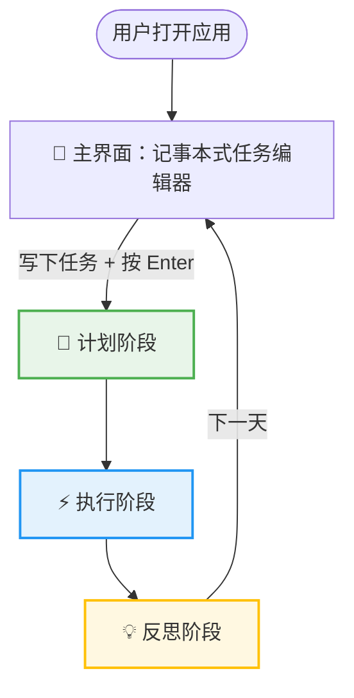
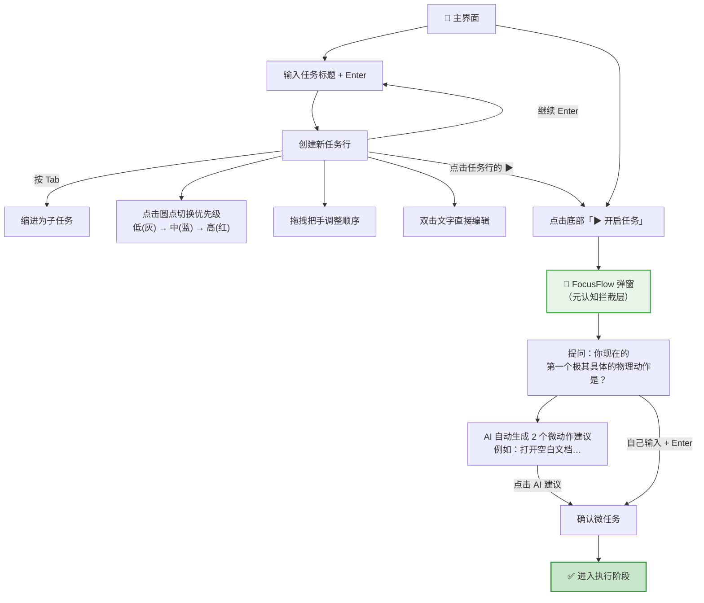
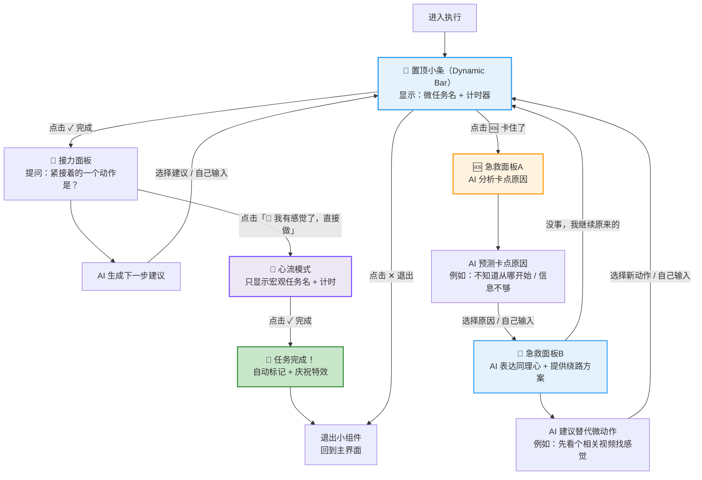
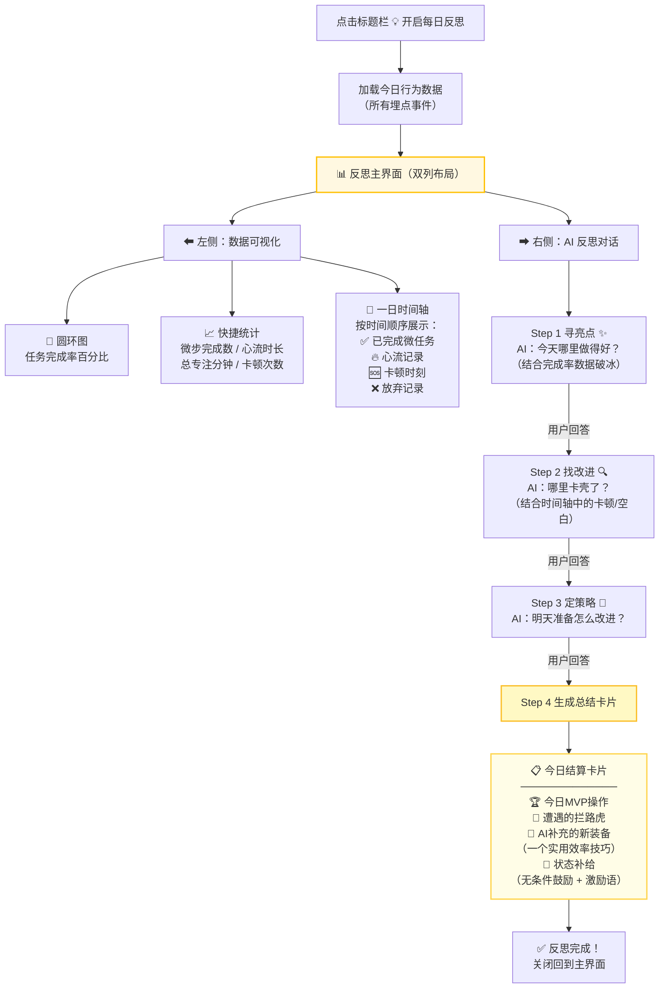

# ADHD Planner 核心交互流程图

> 工具的完整使用流程分为三个阶段：**计划 → 执行 → 反思**

---

## 🔄 总览流程

---

## 📋 阶段一：计划（Planning）

> **核心思路**：用户像写笔记一样快速列出任务，按 Tab 缩进即可创建子任务

**关键点**：
- 「元认知拦截」= 强制用户把模糊的大任务拆成一个极小的第一步
- AI 提供建议降低启动门槛，用户也可以自己输入

---

## ⚡ 阶段二：执行（Execution）

> **核心思路**：窗口缩为置顶小条，一步步微任务接力推进，遇到卡壳有 AI 急救

**关键点**：
- 执行阶段窗口缩为**置顶薄条**，始终浮在其他窗口之上，不打扰又随时可见
- **微任务接力**：完成一步就让你趁热打铁输入下一步，形成正向循环
- **急救机制**：卡住时不是催你"快做"，而是帮你分析原因、换条路走
- **心流入口**：连续完成几步后，一键切换心流模式，不再打断

---

## 💡 阶段三：反思（Reflection）

> **核心思路**：一天结束后，左看数据、右跟 AI 聊天，轻松完成复盘

**关键点**：
- **3问 + 1总结**的固定流程，不多不少，刚好够用
- AI 不是泛泛而谈，而是**结合你今天的真实数据**来提问和总结
- 总结像"领奖励"而不是"写检讨"，**无条件鼓励** + **补充新效率技巧**

---

## 🧩 数据流：三个阶段如何串联

```mermaid
flowchart LR
    subgraph 计划阶段
        A1[用户写下任务]
        A2[选择焦点任务]
        A3[确认第一步微动作]
    end

    subgraph 执行阶段
        B1[微任务执行 + 计时]
        B2[完成/卡住/接力/心流]
        B3[所有行为被记录为事件]
    end

    subgraph 反思阶段
        C1[读取今日事件流]
        C2[生成数据摘要]
        C3[AI 基于数据引导对话]
        C4[输出今日结算卡片]
    end

    A1 --> A2 --> A3 --> B1
    B1 --> B2 --> B3
    B3 -->|"事件存储到本地"| C1
    C1 --> C2 --> C3 --> C4

    style A1 fill:#E8F5E9
    style A2 fill:#E8F5E9
    style A3 fill:#E8F5E9
    style B1 fill:#E3F2FD
    style B2 fill:#E3F2FD
    style B3 fill:#E3F2FD
    style C1 fill:#FFF8E1
    style C2 fill:#FFF8E1
    style C3 fill:#FFF8E1
    style C4 fill:#FFF8E1
```

---

## 📌 一句话总结

> **计划**时把大任务拆成第一个小动作 → **执行**时一步步接力推进（卡住有AI急救）→ **反思**时看数据、聊天、领奖励，形成每日闭环 🔁
