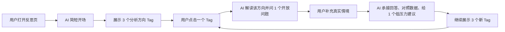
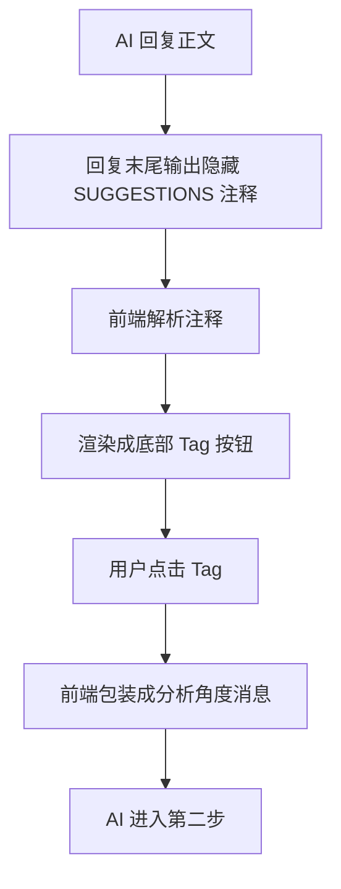

# AI 反思流程与 Tag 展示逻辑

这份文档梳理当前「数据可视化 + AI 反思」的用户流程、AI 对话结构、分析方向 Tag 的分类与展示逻辑。它更偏产品说明，方便之后做论文描述、访谈解释、prompt 调整或前端改版时快速对齐。

## 简短对话流程

当前 AI 反思不是一次性给用户一大段分析，而是一个循环式对话：



用普通话说就是：

1. 用户打开反思页，左边看数据图表，右边和 AI 聊。
2. AI 第一条消息只轻轻指出一个值得看的现象，不急着分析一堆内容。
3. AI 在底部给 3 个「可以聊的方向」Tag。
4. 用户点一个 Tag 后，AI 先解释这个方向为什么值得看，再问一个开放小问题。
5. 用户补充真实情况后，AI 才给一个低压力建议。
6. AI 再给 3 个新的 Tag，让用户可以继续换方向聊。

## 核心定位

AI 的角色不是问卷机器人，也不是效率评判员，而是陪用户看左侧图表，帮助用户从行为数据里看见自己平时不容易注意到的任务管理模式。

核心目标是：

| 目标 | 说明 |
|---|---|
| 看清任务 | 任务真正难在哪里？一开始以为的难点和实际做起来是否一致？ |
| 看清自己 | 用户在什么状态、时间、场景下更容易开始、停住或继续？ |
| 看清策略 | 哪些方法真的帮用户推进了任务？哪些方法效果一般？ |
| 看清规律 | 这次经验能不能转成下次也能用的小经验？ |

一句话总结：

> AI 反思的目标不是让用户回答更多问题，而是帮用户看见自己原来没看见的任务过程。

## 三步循环式反思

### 第一步：AI 开场

开场只做四件事：

| 步骤 | 内容 |
|---|---|
| 简短问候 | 像朋友一样打招呼，可以带用户偏好的称呼。 |
| 一个事实锚点 | 从左侧图表里选一个最值得看的事实或行为现象。 |
| 看图邀请 | 邀请用户看看左边图表，或者点下面的方向。 |
| 生成 3 个 Tag | 给用户 3 个低压力的分析入口。 |

开场特意保持很短，是为了避免用户一进入反思页就被大量分析压住。

开场不能做：

| 不做什么 | 原因 |
|---|---|
| 不追问原因 | 用户刚进入页面，还没有准备好解释自己。 |
| 不马上给建议 | 还没有用户上下文，建议容易变成空泛指导。 |
| 不展开多个图表 | 信息量太大，用户难以扫读。 |
| 不复述所有数字 | 图表上已经能看到的数字，不应该变成主要洞察。 |
| 不替用户下结论 | 反思要先探索，不要直接判断。 |

### 第二步：用户点击 Tag 后

当用户点击底部 Tag 时，前端会把它转成一条给 AI 的特殊消息：

```text
用户选择了分析角度：XXX
```

这时 AI 不能把它当作普通聊天，也不能问「你想聊这个吗」。因为用户点击 Tag 已经说明了想看这个方向。

第二步 AI 要做三件事：

| 步骤 | 内容 |
|---|---|
| 承接 Tag | 用一句自然的话说明这个方向为什么值得看。 |
| 对应分析 | 引用 1 个最相关图表、行为记录、近期记忆或历史线索。 |
| 问开放问题 | 问 1 个短问题，让用户补充真实情境。 |

第二步不生成新 Tag，也不直接给建议。它的目的只是让用户补充「数据里看不到的上下文」。

### 第三步：用户补充上下文后

用户回答第二步的问题后，AI 才进入建议阶段。

第三步 AI 要做：

| 步骤 | 内容 |
|---|---|
| 共情承接 | 先接住用户刚刚说的真实情况。 |
| 数据对照 | 把用户回答和相关图表、任务记录或行为线索轻轻对上。 |
| 低压力建议 | 只给 1 个具体、可尝试、不命令的动作。 |
| 继续给 Tag | 生成 3 个新的分析方向，让用户可以继续聊。 |

建议要像递一个选择，而不是布置作业。

推荐表达：

| 推荐说法 | 不推荐说法 |
|---|---|
| 可以试试 | 你应该 |
| 如果愿意 | 你必须 |
| 也许可以先 | 你需要 |
| 先不用一下子做完 | 下次就这样做 |

## Tag 的产品定位

Tag 是底部「可以聊聊这几个方向」按钮。

它不是：

| 不是 | 例子 |
|---|---|
| 不是结论 | 任务切得刚好、完成得很顺 |
| 不是图表名 | 任务用时分析、电脑活动图 |
| 不是研究分类 | 策略复用、时间状态匹配 |
| 不是评价 | 效率很好、拖延明显 |
| 不是具体点名 | 论文任务一直没开始、15 点学习任务 |

它应该是：

| 是什么 | 说明 |
|---|---|
| 可点击的问题入口 | 用户一眼知道点进去会聊什么。 |
| 任务管理过程的提示 | 背后对应一个可分析的行为 pattern。 |
| 低压力选择 | 用户可以点，也可以不点。 |
| 自然聊天问题 | 更像朋友问「要不要看看这个方向」。 |

## Tag 的三类分类

每次生成 3 个 Tag 时，尽量各占一类：

| 分类 | 目标 | 示例 |
|---|---|---|
| 有效经验类 | 先帮用户看到哪些做法值得保留、哪些条件更容易推进。 | 哪些做法值得保留？哪些时间更容易动起来？哪些任务做起来比较顺？卡住后是怎么接回来的？ |
| 卡点观察类 | 温和地帮助用户看见哪里不顺、哪里容易停住。 | 哪些任务还停在计划里？想看看哪里不顺吗？卡住时卡在哪一步？哪些事总被放到后面？ |
| 中性探索类 | 不预设好坏，只帮助用户看变化、对比或任务分布。 | 和前几天哪里不一样？电脑开着时都在做什么？最忙那段都在忙什么？有哪些没写进计划的事？ |

展示顺序建议：

| 位置 | 类型 | 原因 |
|---:|---|---|
| 第 1 个 | 有效经验类 | 先让用户看到自己已经做成、值得保留的部分。 |
| 第 2 个 | 卡点观察类 | 再温和地看困难和阻力。 |
| 第 3 个 | 中性探索类 | 最后提供一个不带好坏判断的观察方向。 |

这样做的原因是：ADHD 用户很容易在复盘时感到被评价，所以 Tag 不应该一上来全是「哪里不顺」「哪里没做」。

### 当前 Tag 分类总表

| 分类 | 对应 Tag |
|---|---|
| 有效经验类 | 哪些做法值得保留？<br>哪些时间更容易动起来？<br>哪些时间效率较高？<br>哪些任务很快就做完了？<br>哪些任务做起来比较顺？<br>卡住后是怎么接回来的？ |
| 卡点观察类 | 容易卡住的任务<br>想看看哪里不顺吗？<br>卡住时卡在哪一步？<br>哪些事总被放到后面？<br>哪些任务还停在计划里？<br>是哪个步骤让你停住了？ |
| 中性探索类 | 哪些任务反复出现？<br>和前几天哪里不一样？<br>这两天节奏有什么不一样？<br>这周多了哪些任务？<br>这周少了哪些任务？<br>电脑开着时都在做什么？<br>最忙那段都在忙什么？<br>哪个任务花了最多时间？<br>哪些任务最花时间？<br>哪些事被放到后面了？<br>有哪些是临时做的？<br>有哪些没写进计划的事？ |

## Tag 文案规则

### 好 Tag 的标准

| 标准 | 说明 |
|---|---|
| 具体好懂 | 用户不用懂图表术语，也能知道点进去聊什么。 |
| 像自然问题 | 尽量像聊天里的问题，而不是研究报告标题。 |
| 不提前下结论 | Tag 是入口，不是 AI 的判断结果。 |
| 不暴露过多细节 | 具体任务名、应用名、日期、小时等，等用户点开后再讲。 |
| 不写半截话 | 要有明确对象，比如任务、时间、做法、卡点。 |
| 低压力 | 避免让用户感觉被追责或被评价。 |

### 文案例子

| 不推荐 | 推荐 | 原因 |
|---|---|---|
| 任务用时分析 | 哪些任务最花时间？ | 用户关心问题，不关心图表名。 |
| 活动最密的那段 | 最忙那段都在忙什么？ | 补全对象，更像聊天。 |
| 完成率 100% | 哪些做法值得保留？ | 从结果数字转成可复用经验。 |
| 卡顿密集任务 | 容易卡住的任务 | 少一点数据分析味，更接近用户感受。 |
| 停下来的那一步 | 是哪个步骤让你停住了？ | 从半截短语变成完整问题。 |
| 任务切得刚好 | 哪些任务做起来比较顺？ | 不提前下结论，让用户点开后再一起看。 |

## Tag 的生成和展示逻辑

当前实现里，AI 和前端大概这样配合：



AI 输出格式类似：

```html
<!--SUGGESTIONS:["哪些做法值得保留？","哪些任务还停在计划里？","和前几天哪里不一样？"]-->
```

用户看不到这段隐藏注释。前端会把它提取出来，显示成底部按钮。

展示规则：

| 场景 | 是否生成 Tag |
|---|---|
| AI 开场 | 必须生成正好 3 个 Tag |
| 用户点击 Tag 后的第二步 | 不生成 Tag |
| 用户回答上下文后的第三步 | 必须生成正好 3 个新 Tag |
| 对话自然收尾 | 可以不生成 Tag |

## 弹性回应策略

三步循环是默认骨架，不是强制脚本。AI 每轮回复前，应该先判断用户当前最需要的是看懂数据、补充上下文、继续澄清、获得建议，还是结束反思。

| 判断场景 | 回应模式 | AI 应该做什么 | 是否生成新 Tag |
|---|---|---|---|
| 用户刚打开反思页 | 开场模式 | 简短问候，给 1 个事实锚点，邀请看图，并展示 3 个方向。 | 是，正好 3 个 |
| 用户只是点击 Tag，还没有补充内容 | 数据解释模式 | 解释这个 Tag 对应的数据现象，说明它为什么值得看；如果原因不清楚，再轻问 1 个上下文问题。 | 否 |
| 数据只能看到现象，看不出原因 | 上下文问题模式 | 先说清楚数据里能看到什么，再问 1 个开放问题补足真实背景。 | 否 |
| 用户回答很模糊，但里面有重要信号 | 深挖模式 | 先承接用户原话，再继续澄清 1 次，把模糊困难变具体。 | 否 |
| 用户已经说清楚原因，或主动问怎么办 | 建议模式 | 承接用户回答，对照相关数据，给 1 个低压力动作。 | 通常是，给 3 个新方向 |
| 用户回复很短、不想继续，或对话已经有清楚发现 | 收束模式 | 简短总结用户自己的发现，温和鼓励，不强行继续问。 | 可以不生成 |

弹性判断时要守住 3 条硬规则：

| 硬规则 | 作用 |
|---|---|
| 最多连续问 1 个问题 | 避免反思变成审问。 |
| 每轮只有 1 个核心动作 | 要么解释，要么问，要么建议，不要一条消息做太多事。 |
| 除非用户主动要方法，否则建议要等到有足够上下文后再给 | 避免建议太早、太泛。 |

## 图表引用与高亮逻辑

AI 回复会通过两种方式和左侧图表联动。

### 1. 正文图表引用

AI 正文使用这种格式：

```text
【chart:task-duration】
```

前端会把它变成可点击的图表引用。用户点击后，可以定位或高亮对应图表。

常见图表 ID：

| 范围 | 图表 ID | 用途 |
|---|---|---|
| 日反思 | `chart:completion-rate` | 当天任务完成率 |
| 日反思 | `chart:metrics` | 当天核心指标 |
| 日反思 | `chart:task-duration` | 当天任务用时 |
| 日反思 | `chart:activity` | 任务活动分布、卡顿红点、任务发生时间段 |
| 日反思 | `chart:rhythm` | 当天电脑活跃节奏 |
| 日反思 | `chart:app-usage` | 当天应用使用时长 |
| 周反思 | `chart:week-completion` | 每日任务完成率 |
| 周反思 | `chart:week-metrics` | 周核心指标 |
| 周反思 | `chart:week-ranking` | 周任务用时排行 |
| 周反思 | `chart:week-heatmap` | 7 × 24 活动热力图 |
| 周反思 | `chart:week-rhythm` | 周电脑活跃节奏 |
| 周反思 | `chart:week-app-usage` | 本周应用使用时长 |

### 2. 隐藏高亮标记

AI 也可以输出用户看不到的 `VISUAL_REF` 注释，让前端同步高亮左侧具体位置。

示例：

```html
<!--VISUAL_REF:{"targetIds":["task:学习任务"]}-->
```

使用边界：

| 情况 | 高亮方式 |
|---|---|
| 能确定具体任务、时段、应用或指标 | 优先局部高亮 |
| 不确定具体对象 | 只高亮整张图 |
| 周反思 | 当前更保守，主要使用整图高亮 |
| 多个应用并列出现 | 可以高亮 2-3 个应用条目 |

## 日反思和周反思的区别

| 类型 | 关注重点 | 高亮策略 |
|---|---|---|
| 日反思 | 当天任务过程、任务用时、卡住恢复、当天活跃节奏、当天完成情况。 | 可以更细，支持具体任务、时段、应用等局部高亮。 |
| 周反思 | 跨天规律、稳定时段、反复出现但推进不多的任务、一周完成趋势。 | 更保守，优先整图高亮，避免跨天定位不准。 |

## AI 反思的边界

AI 反思需要遵守这些边界：

| 边界 | 原因 |
|---|---|
| 不把图表数字当洞察 | 数字只是证据，洞察要指向任务管理过程。 |
| 不把电脑活跃高峰当成任务完成时间 | 电脑活跃只能说明电脑在用，不能证明任务完成。 |
| 不用完成率评价用户 | 完成率是数据，不是成绩。 |
| 不连续追问 | 连续追问会让反思变成审问。 |
| 不在第二步直接给建议 | 用户还没补充上下文，建议容易不贴合真实情况。 |
| 不用 Tag 下结论 | Tag 是入口，不是判断。 |
| 不把情绪记录当成效率原因 | 心情是状态背景，不是因果解释。 |
| 不追责历史承诺 | 记忆用于理解背景，不用于检查用户有没有做到。 |

## 一次完整示例

### 第一步：AI 开场

```text
上午好呀，来看看今天的情况。

太棒了，今天真的推进得很扎实。今天计划任务都完成了，而且卡住后也有继续接上的记录。

你可以先看看左边的图，哪个地方有点意思？也可以点下面的方向，我陪你一起看。

<!--SUGGESTIONS:["哪些做法值得保留？","哪些任务还停在计划里？","和前几天哪里不一样？"]-->
```

用户实际看到的是正文和 3 个按钮，不会看到 `SUGGESTIONS` 注释。

### 第二步：用户点击 Tag

用户点击：

```text
哪些任务还停在计划里？
```

AI 回复：

```text
可以，先看这个方向，因为它能帮你区分：哪些任务是真的没时间做，哪些任务可能卡在开始前。

【chart:task-duration】今天有些任务已经进入了实际推进，但也有一些还停留在计划里，没有形成用时记录。

回到那些还没开始的任务，最挡在前面的那一小步可能是什么？
```

这一步只问一个开放问题，不给建议，也不生成新 Tag。

### 第三步：用户补充后

用户回答：

```text
我看到论文任务就觉得不知道从哪里开始。
```

AI 回复：

```text
你提到“不知道从哪里开始”，这个很像任务入口太大了，不是你不想做。

【chart:task-duration】它停在计划里没有形成用时记录，所以这里最值得看的不是完成率，而是它还没被拆成一个能立刻动手的小入口。

如果下次还是看到论文就卡住，可以先把第一步写成“打开文档，看一眼标题和摘要”，先不用决定后面怎么写。

<!--SUGGESTIONS:["哪些时间更容易动起来？","卡住时卡在哪一步？","电脑开着时都在做什么？"]-->
```

这样一轮就完成了：Tag 帮用户选方向，AI 问上下文，用户补充后，AI 才把数据和真实情况合在一起给一个低压力建议。

## 相关文件

| 文件 | 作用 |
|---|---|
| `src/renderer/src/services/ai.ts` | 生成每日反思和周反思 system prompt，定义三步循环、Tag 规则、图表引用和高亮边界。 |
| `src/renderer/src/components/ReflectionChat.tsx` | 解析 `SUGGESTIONS`，展示 Tag 按钮，处理用户点击 Tag 后发送给 AI 的特殊消息。 |
| `src/renderer/src/components/ReflectionView.tsx` | 组装反思页数据上下文，把任务、活动、心情、应用使用等信息传给 AI。 |
| `docs/data-visualization-reflection-prompt.md` | 当前数据可视化反思 prompt 的详细整理。 |
| `docs/reflection-tag-copy-guide.md` | Tag 文案优化和分类参考。 |
