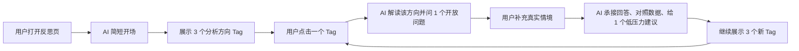
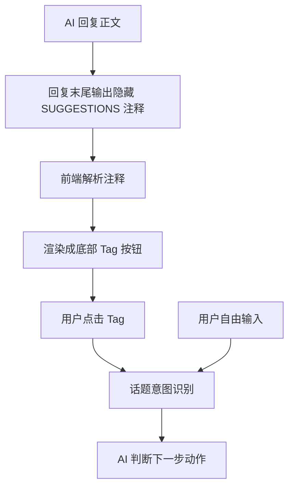

# AI 反思流程与 Tag 展示逻辑

这份文档梳理当前「数据可视化 + AI 反思」的用户流程、AI 对话结构、分析方向 Tag 的分类与展示逻辑。它更偏产品说明，方便之后做论文描述、访谈解释、prompt 调整或前端改版时快速对齐。

## 简短对话流程

当前 AI 反思有两种模式：

| 模式 | 默认状态 | 适合场景 |
|---|---|---|
| 默认三段式 | 默认开启 | 研究流程更稳定，便于保证每次都有“看数据 → 补上下文 → 给建议”的完整闭环。 |
| 自由反思 | 用户手动打开 | 对话更像自然聊天，AI 会判断什么时候追问、澄清、建议、收束或给新方向。 |

默认三段式不是一次性给用户一大段分析，而是一个循环式对话：



用普通话说，默认模式就是：

1. 用户打开反思页，左边看数据图表，右边和 AI 聊。
2. AI 第一条消息只轻轻指出一个值得看的现象，不急着分析一堆内容。
3. AI 在底部给 3 个「可以聊的方向」Tag。
4. 用户点一个 Tag 后，AI 先解释这个方向为什么值得看，再问一个开放小问题。
5. 用户补充真实情况后，AI 才给一个低压力建议。
6. AI 再给 3 个新的 Tag，让用户可以继续换方向聊。

自由反思模式会保留开场和 Tag，但不会强制每轮都走“第二步/第三步”。AI 每轮先判断用户当前最需要什么：数据不够解释原因时先问 1 个上下文问题；用户已经说清楚原因时给 1 个低压力建议；用户回复模糊但有重要线索时再澄清 1 次；用户已经有发现或不想继续时温和收束；还需要探索时才展示新的 Tag。

## 核心定位

AI 的角色不是问卷机器人，也不是效率评判员，而是陪用户看左侧图表，帮助用户从行为数据里看见自己平时不容易注意到的任务管理模式。

核心目标是：

| 目标 | 说明 |
|---|---|
| 看清任务 | 任务真正难在哪里？一开始以为的难点和实际做起来是否一致？ |
| 看清自己 | 用户在什么状态、时间、场景下更容易开始、停住或继续？ |
| 看清策略 | 哪些方法真的帮用户推进了任务？哪些方法效果一般？ |
| 看清规律 | 这次经验能不能转成下次也能用的小经验？ |

一句话总结：

> AI 反思的目标不是让用户回答更多问题，而是帮用户看见自己原来没看见的任务过程。

## 三步循环式反思

### 第一步：AI 开场

开场只做四件事：

| 步骤 | 内容 |
|---|---|
| 简短问候 | 像朋友一样打招呼，可以带用户偏好的称呼。 |
| 一个事实锚点 | 从左侧图表里选一个最值得看的事实或行为现象。 |
| 看图邀请 | 邀请用户看看左边图表，或者点下面的方向。 |
| 生成 3 个 Tag | 给用户 3 个低压力的分析入口。 |

开场特意保持很短，是为了避免用户一进入反思页就被大量分析压住。

开场不能做：

| 不做什么 | 原因 |
|---|---|
| 不追问原因 | 用户刚进入页面，还没有准备好解释自己。 |
| 不马上给建议 | 还没有用户上下文，建议容易变成空泛指导。 |
| 不展开多个图表 | 信息量太大，用户难以扫读。 |
| 不复述所有数字 | 图表上已经能看到的数字，不应该变成主要洞察。 |
| 不替用户下结论 | 反思要先探索，不要直接判断。 |

### 第二步：用户点击 Tag 后

当用户点击底部 Tag 时，前端会把它转成一条给 AI 的特殊消息：

```text
用户选择了分析角度：XXX
```

这时 AI 不能把它当作普通聊天，也不能问「你想聊这个吗」。因为用户点击 Tag 已经说明了想看这个方向。

第二步 AI 要做三件事：

| 步骤 | 内容 |
|---|---|
| 承接 Tag | 用一句自然的话说明这个方向为什么值得看。 |
| 对应分析 | 引用 1 个最相关图表、行为记录、近期记忆或历史线索。 |
| 问开放问题 | 问 1 个短问题，让用户补充真实情境。 |

第二步不生成新 Tag，也不直接给建议。它的目的只是让用户补充「数据里看不到的上下文」。

### 第三步：用户补充上下文后

用户回答第二步的问题后，AI 才进入建议阶段。

第三步 AI 要做：

| 步骤 | 内容 |
|---|---|
| 共情承接 | 先接住用户刚刚说的真实情况。 |
| 数据对照 | 把用户回答和相关图表、任务记录或行为线索轻轻对上。 |
| 低压力建议 | 只给 1 个具体、可尝试、不命令的动作。 |
| 继续给 Tag | 生成 3 个新的分析方向，让用户可以继续聊。 |

建议要像递一个选择，而不是布置作业。

推荐表达：

| 推荐说法 | 不推荐说法 |
|---|---|
| 可以试试 | 你应该 |
| 如果愿意 | 你必须 |
| 也许可以先 | 你需要 |
| 先不用一下子做完 | 下次就这样做 |

## Tag 的产品定位

Tag 是底部「可以聊聊这几个方向」按钮。

它不是：

| 不是 | 例子 |
|---|---|
| 不是结论 | 任务切得刚好、完成得很顺 |
| 不是图表名 | 任务用时分析、电脑活动图 |
| 不是研究分类 | 策略复用、时间状态匹配 |
| 不是评价 | 效率很好、拖延明显 |
| 不是具体点名 | 论文任务一直没开始、15 点学习任务 |

它应该是：

| 是什么 | 说明 |
|---|---|
| 可点击的问题入口 | 用户一眼知道点进去会聊什么。 |
| 任务管理过程的提示 | 背后对应一个可分析的行为 pattern。 |
| 低压力选择 | 用户可以点，也可以不点。 |
| 自然聊天问题 | 更像朋友问「要不要看看这个方向」。 |

## Tag 的候选分类

分类只是候选池，不是固定配额。模型生成 Tag 时，应根据当前 AI 回复、用户刚说的话、已经聊过的内容动态选择，不需要每次硬凑“有效经验类 1 个、卡点观察类 1 个、中性探索类 1 个”。

| 分类 | 目标 | 示例 |
|---|---|---|
| 有效经验类 | 先帮用户看到哪些做法值得保留、哪些条件更容易推进。 | 今天有哪些可以复用的小规律？哪些时间更容易动起来？哪些任务推进得比较连续？ |
| 卡点观察类 | 温和地帮助用户看见哪里不顺、哪里容易停住。 | 哪些任务还停在计划里？想看看哪里不顺吗？哪些事总被放到后面？ |
| 中性探索类 | 不预设好坏，只帮助用户看变化、对比或任务分布。 | 和前几天哪里不一样？电脑开着时都在做什么？最活跃那段在做什么？有哪些没写进计划的事？ |
| 情绪 × 行为观察类 | 只在有心情记录、用户主动提到状态，或当前主线涉及开始困难/卡顿/节奏变化时使用。情绪是一天粒度，必须结合前几天或本周不同天对比。 | 今天的心情和前几天有什么不同？今天这种心情下，哪些任务更容易开始？今天这种心情下，哪里更容易中断？哪些天状态和完成度不一致？ |

动态选择时的排序标准：

| 优先级 | 说明 |
|---|---|
| 贴近当前主线 | Tag 要顺着 AI 刚刚解释的现象或用户刚刚补充的上下文。 |
| 不重复已聊内容 | 已经点过或聊过的方向不要换个说法再出现。 |
| 能促进元认知 | 帮用户看清任务、自己、策略或规律，而不是只看图表结果。 |
| 低压力 | 不要让用户感觉被追责；如果连续出现多个卡点类，可以混入更中性的方向。 |

### 当前 Tag 池

日视图：

| 分类 | 对应 Tag |
|---|---|
| 有效经验类 | 今天有哪些可以复用的小规律？<br>哪些时间更容易动起来？<br>哪些任务很快就做完了？<br>哪些任务推进得比较连续？ |
| 卡点观察类 | 哪些任务还停在计划里？<br>想看看哪里不顺吗？<br>哪些事总被放到后面？ |
| 中性探索类 | 和前几天哪里不一样？<br>这两天节奏有什么不一样？<br>电脑开着时都在做什么？<br>最活跃那段在做什么？<br>有哪些没写进计划的事？ |
| 情绪 × 行为观察类 | 今天的心情和前几天有什么不同？<br>今天这种心情下，哪些任务更容易开始？<br>今天这种心情下，哪里更容易中断？ |

周视图：

| 分类 | 对应 Tag |
|---|---|
| 有效经验类 | 这周有哪些可以复用的小规律？<br>这周哪些时间更容易开始任务？<br>这周哪些时段任务推进最多？<br>这周哪些任务用时比较短？<br>哪些任务做起来比较顺？<br>这周中断后，通常怎么重新开始？ |
| 卡点观察类 | 哪些任务还停在计划里？<br>想看看哪里不顺吗？<br>这周哪些任务经常晚些才开始？ |
| 中性探索类 | 这周电脑活跃时主要在做什么？<br>这周最活跃的时段主要在做什么？<br>这周多了哪些任务？<br>这周少了哪些任务？ |
| 情绪 × 行为观察类 | 哪些状态下更容易开始？<br>状态不同的天任务怎么变了？<br>状态低的天卡在哪里？<br>哪些天状态和完成度不一致？<br>不同心情的日子，任务节奏有什么不同？ |

## Tag 文案规则

### 好 Tag 的标准

| 标准 | 说明 |
|---|---|
| 具体好懂 | 用户不用懂图表术语，也能知道点进去聊什么。 |
| 像自然问题 | 尽量像聊天里的问题，而不是研究报告标题。 |
| 不提前下结论 | Tag 是入口，不是 AI 的判断结果。 |
| 不暴露过多细节 | 具体任务名、应用名、日期、小时等，等用户点开后再讲。 |
| 不写半截话 | 要有明确对象，比如任务、时间、做法、卡点。 |
| 低压力 | 避免让用户感觉被追责或被评价。 |

### 文案例子

| 不推荐 | 推荐 | 原因 |
|---|---|---|
| 任务用时分析 | 哪些任务最花时间？ | 用户关心问题，不关心图表名。 |
| 活动最密的那段 | 最忙那段都在忙什么？ | 补全对象，更像聊天。 |
| 完成率 100% | 哪些做法值得保留？ | 从结果数字转成可复用经验。 |
| 卡顿密集任务 | 容易卡住的任务 | 少一点数据分析味，更接近用户感受。 |
| 停下来的那一步 | 是哪个步骤让你停住了？ | 从半截短语变成完整问题。 |
| 任务切得刚好 | 哪些任务做起来比较顺？ | 不提前下结论，让用户点开后再一起看。 |

Tag 文案统一回到标准方向池，不再临时生成“找找今天的小努力”“捡一个小招”这类新文案。自由反思模式仍然可以更自然地回应，但底部 Tag 优先从标准池里挑选，例如“今天有哪些可以复用的小规律？”“哪些任务还停在计划里？”“电脑开着时都在做什么？”“今天的心情和前几天有什么不同？”。

## Tag 的生成和展示逻辑

当前实现里，AI 和前端大概这样配合：



AI 输出格式类似：

```html
<!--SUGGESTIONS:["哪些做法值得保留？","哪些任务还停在计划里？","和前几天哪里不一样？"]-->
```

用户看不到这段隐藏注释。前端会把它提取出来，显示成底部按钮。

前端会保留一组候选 Tag，每次只展示 3 个。初始展示页会按当前反思日期或会话轻微轮换，避免每天都先看到同一组三个方向。标题右侧的“换一批”图标只切换当前展示的候选方向，不会发送消息，也不会开启新一轮对话。只有用户真正点击某个 Tag 时，才会把它包装成话题消息发给 AI。

展示规则：

| 场景 | 是否生成 Tag |
|---|---|
| AI 开场（默认三段式） | 通常生成一组标准 Tag 候选，前端每次展示 3 个，可换一批 |
| 用户点击 Tag 后的第二步（默认三段式） | 不生成 Tag |
| 用户回答上下文后的第三步（默认三段式） | 通常生成一组新标准 Tag 候选；若对话已收束可以不生成 |
| 自由反思模式 | 按需要生成 0 个或一组标准 Tag 候选；追问、澄清或收束时可以不生成 |
| 对话自然收尾 | 可以不生成 Tag |

### 话题意图识别

自由反思下，前端不仅会识别用户点击的 Tag，也会识别用户自己输入的问题。两种入口共用同一套分流规则，避免“点 Tag 能答对、自己问就答偏”。

| 话题类型 | 触发示例 | 回复重点 |
|---|---|---|
| 对比类 | 今天和昨天有什么不同？ / 和前几天哪里不一样？ | 先回答“不同在哪里”；历史不足时明确不能硬比，不只描述今天。 |
| 心情对比类 | 今天的心情和前几天有什么不同？ / 最近几天心情有什么变化？ | 先比较心情记录，再谨慎连接行为；不把心情当成效率原因。 |
| 心情行为类 | 今天这种心情下，哪些任务更容易开始？ | 把心情当背景，重点看任务、时段、卡点或中断位置。 |
| 时间活跃类 | 最活跃那段在做什么？ / 高峰时段做了什么？ | 优先结合活动分布、电脑活动或应用使用；电脑活跃不等于任务完成。 |
| 任务模式类 | 哪些任务推进得比较连续？ / 哪些任务还停在计划里？ | 优先结合任务用时、任务状态或任务活动，不只讲总完成率。 |

## 弹性回应策略

三步循环是默认骨架；打开自由反思后，AI 不再继承“第二步/第三步”的强模板。用户点 Tag 时，前端会告诉 AI“用户想顺着这个话题聊”，AI 每轮回复前应该先判断用户当前最需要的是看懂数据、补充上下文、继续澄清、获得建议、换个方向，还是结束反思。

自由模式使用“微技能选择器”，不是固定脚本。AI 每轮先判断用户状态，再只选择一个动作：接住情绪、肯定努力、换视角、提取做法、轻问一个问题、给方向选择、小实验或温和收束。

前端还会在自由模式下加入一层轻量对话管理。用户发送消息时，`ReflectionChat` 会先把这句话归到一个大致状态，例如选择方向、情绪首轮、情绪来源、困难变轻、无话可说、提取做法、主动问怎么办、想结束或开放补充。这个判断只作为隐藏指令发给 AI，用户不会看到；默认三段式不会使用这层调度。

这层调度的目的不是替用户反思，而是先帮 AI 选对本轮动作：该接住时不建议，该收束时不追问，该给方向时不逼用户解释。

第一版自由模式额外强调 7 件事：

| 规则 | 说明 |
|---|---|
| 情绪先接住 | 用户主动说情绪不好、烦、累、焦虑、不想做时，先接住并轻问来源，不立刻分析效率或给建议。 |
| 反思有深浅 | 轻层只接住和给方向；中层轻问并连接数据；深层只在用户主动困扰、反复模式或想深入时使用。 |
| 努力证据优先 | 结果不理想或用户自责时，先从数据里找启动、中断后回来、小推进、记录卡点、拆小任务等具体证据，再分析问题。 |
| 回复要短 | 默认 80-120 个中文字，最多 2 个短段落；每轮最多 1 个问题、1 个建议、2 个数字。 |
| 每轮只做一个动作 | 要么解释，要么问上下文，要么给小建议，要么收束，不把数据报告、提问和方法堆在一起。 |
| 不为继续而提问 | 只有答案能帮助用户下次更容易开始、继续、恢复，或看见自己做对了什么时，才问。 |
| 建议像小实验 | 建议用“下次可以试一个很小的实验...”表达，避免像命令或作业。 |

| 判断场景 | 回应模式 | AI 应该做什么 | 是否生成新 Tag |
|---|---|---|---|
| 用户刚打开反思页 | 开场模式 | 简短问候，给 1 个事实锚点，邀请看图，并展示方向。 | 默认 3 个；自由模式可 0-3 个 |
| 用户只是点击 Tag，还没有补充内容 | 数据解释模式 | 解释这个 Tag 对应的数据现象，说明它为什么值得看；如果原因不清楚，再轻问 1 个上下文问题。 | 否 |
| 数据只能看到现象，看不出原因 | 上下文问题模式 | 先说清楚数据里能看到什么，再问 1 个开放问题补足真实背景。 | 否 |
| 用户回答很模糊，但里面有重要信号 | 深挖模式 | 先承接用户原话，再继续澄清 1 次，把模糊困难变具体。 | 否 |
| 用户已经说清楚原因，或主动问怎么办 | 建议模式 | 承接用户回答，对照相关数据，给 1 个低压力动作。 | 默认给 3 个；自由模式按需要 0-3 个 |
| 用户回复很短、不想继续，或对话已经有清楚发现 | 收束模式 | 简短总结用户自己的发现，温和鼓励，不强行继续问。 | 可以不生成 |

弹性判断时要守住 3 条硬规则：

| 硬规则 | 作用 |
|---|---|
| 最多连续问 1 个问题 | 避免反思变成审问。 |
| 每轮只有 1 个核心动作 | 要么解释，要么问，要么建议，不要一条消息做太多事。 |
| 除非用户主动要方法，否则建议要等到有足够上下文后再给 | 避免建议太早、太泛。 |

### 自由模式情绪探索

用户主动表达情绪时，第一轮默认不建议。AI 应该先接住这个状态，再轻问一个低负担问题；用户补充后，再把情绪来源和行为数据连接起来。

| 场景 | 推荐做法 |
|---|---|
| 用户说“情绪不太好” | 先承认这个状态值得看见，不急着变成建议。 |
| 有心情记录 | 不重复问“心情怎么样”，只轻轻引用状态背景。 |
| 没有心情记录但用户主动提到情绪 | 可以问“这种不太好大概是什么感觉？” |
| 用户补充来源后 | 再结合任务启动、子任务、任务用时、卡顿点等数据，提取行为模式或小实验。 |

不推荐：用户刚说情绪不好，就直接说“你还能完成任务很棒，下次继续这样做”。这太快跳到建议，会让用户感觉情绪没有被真正接住。

### 自由模式数据引导

用户说“不知道聊什么”“不知道”“还好”时，不继续追问。AI 可以轻轻说“不用现在想清楚，可以先从下面方向里挑一个”，再让标准 Tag 和“换一批”承担探索入口。

### 自由模式提问质量

自由模式下，问题必须能导向一个可保留做法或下次更容易开始的小线索。不要问用户已经知道、数据已经能回答、或回答后也无法转成策略的问题。

优先问：

| 目标 | 示例 |
|---|---|
| 提取可保留做法 | 回想这次顺下来的过程，前面有没有一个很小的动作让任务更容易接上？ |
| 降低下次开始难度 | 下次做类似任务时，可以先做哪一小步？ |
| 看见积极条件 | 开始前有什么小细节帮你稳住了？ |
| 从短词里提取策略 | 如果用户说“子任务”，优先总结它如何帮任务变小，而不是问怎么想到的。 |

避免问：

| 避免问题 | 原因 |
|---|---|
| 为什么卡住？ | 容易让用户重新解释痛苦，且不一定转成策略。 |
| 你是下意识还是特意选的？ | 追问心理来源，策略价值低。 |
| 你是怎么想到这样拆的？ | 用户回答后也难迁移，容易增加负担。 |
| 今天最大的收获是什么？ | 问题太重，像作业。 |
| 最先影响的是不想开始，还是做着做着停下来？ | 二选一会限制用户，只是在选项里回答。应改问“状态不好时，任务节奏最先变慢的地方通常在哪里？” |

## 图表引用与高亮逻辑

AI 回复会通过两种方式和左侧图表联动。

### 1. 正文图表引用

AI 正文使用这种格式：

```text
【chart:task-duration】
```

前端会把它变成可点击的图表引用。用户点击后，可以定位或高亮对应图表。

常见图表 ID：

| 范围 | 图表 ID | 用途 |
|---|---|---|
| 日反思 | `chart:completion-rate` | 当天任务完成率 |
| 日反思 | `chart:metrics` | 当天核心指标 |
| 日反思 | `chart:task-duration` | 当天任务用时 |
| 日反思 | `chart:activity` | 任务活动分布、卡顿红点、任务发生时间段 |
| 日反思 | `chart:rhythm` | 当天电脑活跃节奏 |
| 日反思 | `chart:app-usage` | 当天应用使用时长 |
| 周反思 | `chart:week-completion` | 每日任务完成率 |
| 周反思 | `chart:week-metrics` | 周核心指标 |
| 周反思 | `chart:week-ranking` | 周任务用时排行 |
| 周反思 | `chart:week-heatmap` | 7 × 24 活动热力图 |
| 周反思 | `chart:week-rhythm` | 周电脑活跃节奏 |
| 周反思 | `chart:week-app-usage` | 本周应用使用时长 |

### 2. 隐藏高亮标记

AI 也可以输出用户看不到的 `VISUAL_REF` 注释，让前端同步高亮左侧具体位置。

示例：

```html
<!--VISUAL_REF:{"targetIds":["task:学习任务"]}-->
```

使用边界：

| 情况 | 高亮方式 |
|---|---|
| 能确定具体任务、时段、应用或指标 | 优先局部高亮 |
| 不确定具体对象 | 只高亮整张图 |
| 周反思 | 当前更保守，主要使用整图高亮 |
| 多个应用并列出现 | 可以高亮 2-3 个应用条目 |

## 日反思和周反思的区别

| 类型 | 关注重点 | 高亮策略 |
|---|---|---|
| 日反思 | 当天任务过程、任务用时、卡住恢复、当天活跃节奏、当天完成情况。 | 可以更细，支持具体任务、时段、应用等局部高亮。 |
| 周反思 | 跨天规律、稳定时段、反复出现但推进不多的任务、一周完成趋势。 | 更保守，优先整图高亮，避免跨天定位不准。 |

## AI 反思的边界

AI 反思需要遵守这些边界：

| 边界 | 原因 |
|---|---|
| 不把图表数字当洞察 | 数字只是证据，洞察要指向任务管理过程。 |
| 不把电脑活跃高峰当成任务完成时间 | 电脑活跃只能说明电脑在用，不能证明任务完成。 |
| 不用完成率评价用户 | 完成率是数据，不是成绩。 |
| 不连续追问 | 连续追问会让反思变成审问。 |
| 不在第二步直接给建议 | 用户还没补充上下文，建议容易不贴合真实情况。 |
| 不用 Tag 下结论 | Tag 是入口，不是判断。 |
| 不把情绪记录当成效率原因 | 心情是状态背景，不是因果解释。 |
| 不追责历史承诺 | 记忆用于理解背景，不用于检查用户有没有做到。 |

## 一次完整示例

### 第一步：AI 开场

```text
上午好呀，来看看今天的情况。

太棒了，今天真的推进得很扎实。今天计划任务都完成了，而且卡住后也有继续接上的记录。

你可以先看看左边的图，哪个地方有点意思？也可以点下面的方向，我陪你一起看。

<!--SUGGESTIONS:["哪些做法值得保留？","哪些任务还停在计划里？","和前几天哪里不一样？"]-->
```

用户实际看到的是正文和 3 个按钮，不会看到 `SUGGESTIONS` 注释。

### 第二步：用户点击 Tag

用户点击：

```text
哪些任务还停在计划里？
```

AI 回复：

```text
可以，先看这个方向，因为它能帮你区分：哪些任务是真的没时间做，哪些任务可能卡在开始前。

【chart:task-duration】今天有些任务已经进入了实际推进，但也有一些还停留在计划里，没有形成用时记录。

回到那些还没开始的任务，最挡在前面的那一小步可能是什么？
```

这一步只问一个开放问题，不给建议，也不生成新 Tag。

### 第三步：用户补充后

用户回答：

```text
我看到论文任务就觉得不知道从哪里开始。
```

AI 回复：

```text
你提到“不知道从哪里开始”，这个很像任务入口太大了，不是你不想做。

【chart:task-duration】它停在计划里没有形成用时记录，所以这里最值得看的不是完成率，而是它还没被拆成一个能立刻动手的小入口。

如果下次还是看到论文就卡住，可以先把第一步写成“打开文档，看一眼标题和摘要”，先不用决定后面怎么写。

<!--SUGGESTIONS:["哪些时间更容易动起来？","卡住时卡在哪一步？","电脑开着时都在做什么？"]-->
```

这样一轮就完成了：Tag 帮用户选方向，AI 问上下文，用户补充后，AI 才把数据和真实情况合在一起给一个低压力建议。

## 相关文件

| 文件 | 作用 |
|---|---|
| `src/renderer/src/services/ai.ts` | 生成每日反思和周反思 system prompt，定义三步循环、Tag 规则、图表引用和高亮边界。 |
| `src/renderer/src/components/ReflectionChat.tsx` | 解析 `SUGGESTIONS`，展示 Tag 按钮，处理用户点击 Tag 后发送给 AI 的特殊消息。 |
| `src/renderer/src/components/ReflectionView.tsx` | 组装反思页数据上下文，把任务、活动、心情、应用使用等信息传给 AI。 |
| `docs/data-visualization-reflection-prompt.md` | 当前数据可视化反思 prompt 的详细整理。 |
| `docs/reflection-tag-copy-guide.md` | Tag 文案优化和分类参考。 |
