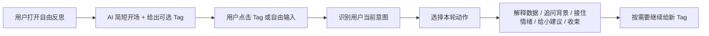
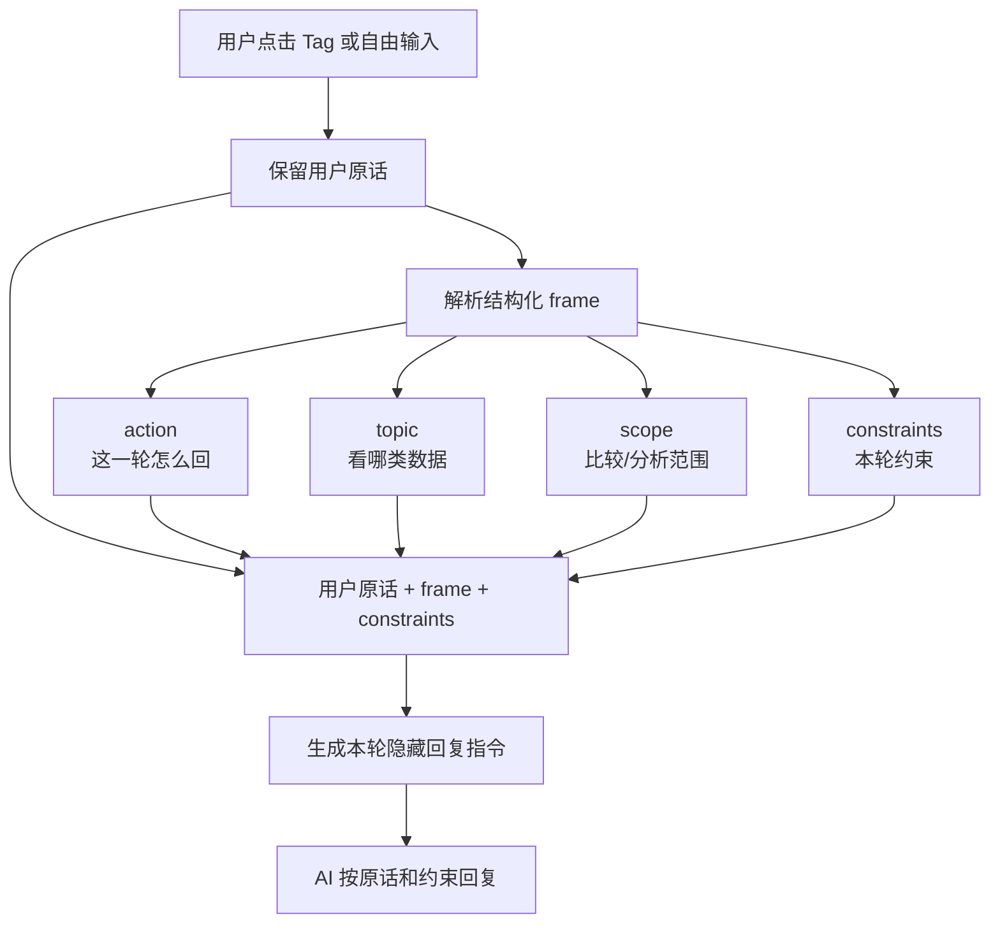
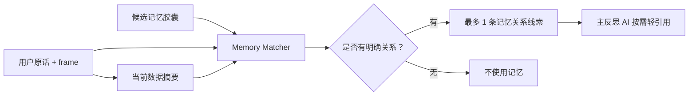

# 自由反思模式说明

## 1. 自由反思是什么

自由反思是反思页里更接近自然聊天的一种模式。它不强制用户按照固定的“点击方向 → 回答问题 → 接收建议”流程走，而是允许用户直接说自己想聊什么、哪里困惑、情绪怎么样，或者不知道想聊什么。

它的目标不是让 AI 问更多问题，而是让 AI 根据用户当前状态，选择最合适的一步：解释数据、追问背景、接住情绪、提取做法、给一个小建议，或者温和收束。

## 2. 为什么需要自由反思

默认三段式流程比较稳定，适合保证每次都有完整的“看数据 → 补上下文 → 给建议”闭环。

但真实用户反思时不一定会按这个顺序表达。有时候用户会直接问“今天和前几天哪里不一样”，有时候会说“我也不知道聊什么”，有时候先表达情绪，比如“今天状态不太好”。

所以自由反思要解决的是：

- 用户不一定先点击 Tag，也可能直接输入问题。
- 用户不一定需要建议，有时只是需要先看懂数据。
- 用户情绪低或能量低时，不应该继续追问。
- 用户已经说清楚原因时，AI 不应该再问，而应该提取一个可尝试的小动作。

## 3. 对话流



自由反思的关键是：每一轮只做一个核心动作，不把数据分析、追问、建议和鼓励全部堆在一条回复里。

## 4. 意图和主题怎么识别

自由反思现在不再只给用户输入贴一个粗标签，例如 `comparison_topic`。它会把一轮用户输入解析成一个更细的结构化 frame，同时把用户原话一起发给 AI。

这个 frame 包含四个部分：

| 字段 | 作用 | 例子 |
|---|---|---|
| `action` | 这一轮 AI 应该做什么 | 比较、建议、引导、接住情绪、收束 |
| `topic` | 主要看哪类数据 | 任务、时间、心情、卡顿、整体节奏 |
| `scope` | 分析或比较的范围 | 今天 vs 昨天、今天 vs 前几天、本周不同天 |
| `constraints` | 用户原话里的限制 | 只比较昨天；不要用 13 天历史平均代替昨天 |

这样做是为了避免“识别到一类就都按一个模板处理”。AI 不只知道“这是对比类”，还知道用户具体问的是哪个范围、哪个主题、哪些内容不能越界。



### frame 是怎么判断的

frame 不是用户能看到的内容，而是前端给 AI 的内部调度信息。判断时会综合三个来源：

1. **用户原话**：原样保留用户到底怎么问，避免结构化标签抹掉细节。
2. **关键词和范围词**：例如“昨天”“前几天”“怎么办”“最活跃”“任务”等。
3. **消息来源**：用户是自己输入，还是点击了底部 Tag。

生成隐藏指令时会同时包含：

```text
用户原话：今天和昨天有什么不一样？

结构化理解：
- action: compare
- topic: overall
- scope: today_vs_yesterday
- source: input

本轮约束：
- 用户明确问到“昨天”，只比较当前日期和昨天。
- 不要把比较范围扩大到前几天、前几次、13 天历史平均或长期规律。
- 如果没有昨天数据，明确说现在没有昨天数据，不能硬比较。
```

### 当前支持的 action

| action | 什么时候触发 | AI 应该怎么回 |
|---|---|---|
| `compare` | 用户问不同、变化、对比 | 先回答差异，不只描述当前日期 |
| `suggest` | 用户问“怎么办”“有什么办法”“建议” | 直接给 1 个低压力小尝试 |
| `guide` | 用户说“不知道聊什么”“随便”“都行” | 不追问，降低负担，引导看下面方向 |
| `close` | 用户说“先这样”“不用了”“可以了” | 温和收束，不挽留 |
| `comfort` | 用户表达烦、累、焦虑、低落、不想做 | 先接住情绪，不立刻建议或分析效率 |
| `soften_stuck` | 用户说卡住、做不下去、压力大、接不上 | 不问“为什么卡住”，把问题变轻 |
| `extract_strategy` | 用户提到拆小任务、先做一点、已经完成 | 提取成下次可保留的小做法 |
| `explain_topic` | 用户点击 Tag，或问时间/任务/心情下的具体方向 | 结合 1 个数据线索解释这个方向 |
| `open` | 没有命中以上规则的普通补充 | 开放回应；能总结就总结，确实缺信息才问 1 个问题 |

### 当前支持的 topic 和 scope

| 字段 | 取值 | 说明 |
|---|---|---|
| `topic` | `overall` | 整体节奏或泛对比 |
| `topic` | `task` | 任务状态、用时、推进、完成、停在计划 |
| `topic` | `time` | 时间段、电脑活跃、最忙时段 |
| `topic` | `mood` | 心情、状态，以及心情背景下的任务节奏 |
| `topic` | `stuck` | 卡住、中断、做不下去 |
| `topic` | `strategy` | 子任务、拆小任务、先做一点等做法 |
| `scope` | `today_vs_yesterday` | 只比较当前日期和昨天 |
| `scope` | `today_vs_recent_days` | 比较当前日期和前几天/最近几天 |
| `scope` | `this_week_days` | 比较本周不同日期 |
| `scope` | `current_period` | 当前日或当前周内部分析 |
| `scope` | `unspecified` | 用户没有明确范围，AI 需要谨慎判断 |

### 用一个例子说明

假设用户输入：

```text
今天和昨天有什么不一样？
```

现在系统不会只标成“对比类”，而是解析成：

```text
action: compare
topic: overall
scope: today_vs_yesterday
constraints:
- 只比较今天和昨天
- 不用前几天、前几次或 13 天历史平均代替昨天
- 没有昨天数据时明确说明不能硬比
```

同时，反思页会额外给 AI 一条“昨日对比线索”。如果昨天有数据，会列出昨天和当前日期的完成任务数、未完成任务数、专注时长和卡顿次数；如果昨天没有数据，会明确告诉 AI 不要用 13 天历史平均代替昨天。

理想回复应该像这样：

```text
可以，比昨天看有两个比较明显的不同。

1. 今天的卡顿次数是 **0 次**，比昨天少。
2. 今天专注时长更短，但计划里的任务都完成了，没有剩到第二天的待办。

回头看这两天，今天更容易收尾的地方可能在哪里？
```

再看另一个输入：

```text
我不知道聊哪些任务，怎么办？
```

这句话虽然出现了“任务”，但 action 会优先识别成 `suggest`，topic 是 `task`。所以 AI 会给一个低压力小尝试，而不是开始分析任务数据。

这说明：`action` 决定这一轮怎么回，`topic` 决定参考哪类数据，`scope` 和 `constraints` 决定不能越界到哪里。

## 5. 记忆如何参与自由反思

自由反思现在加入了一个轻量的 **memory matcher**。它不是直接把所有记忆塞给主回复 AI，而是先判断“当前这轮反思”和“候选记忆”有没有明确关系。



memory matcher 只输出结构化关系，不直接生成用户可见回复。当前支持 4 种关系：

| 关系 | 含义 | 适合怎么用 |
|---|---|---|
| `similar_pattern` | 当前情况和过去某个模式相似 | 帮用户看见“这可能是一个熟悉模式” |
| `reuse_strategy` | 过去某个做法可以复用 | 在用户问怎么办时，递回一个曾经省力的小做法 |
| `positive_change` | 当前数据体现出和过去相比的变化 | 帮用户看见进展，而不是只看没完成 |
| `state_context` | 当前状态和过去状态应对方式相关 | 让回应更贴合用户状态，但不做情绪因果判断 |

注入给主反思 AI 的格式类似：

```text
【可用记忆关系线索】
关系：reuse_strategy
过去记忆：用户之前觉得先打开资料页比直接写更省力。
当前证据：用户现在问“怎么办”，当前写作任务停在计划里。
使用方式：如果本轮要给建议，可以把这条记忆轻轻转成一个可选小实验。
边界：每轮最多引用这一条记忆；不要说“你又...”“上次明明...”。
```

记忆使用边界：

- 每轮最多引用 1 条记忆。
- 没有明确关系时不使用记忆。
- 不连续围绕记忆展开。
- 不用记忆监督用户有没有做到以前说过的事。
- 当前数据和用户原话已经足够回答时，不为了使用记忆而使用记忆。

## 6. 当前支持的主题类型

| 用户表达 | 主题类型 | AI 回复重点 |
|---|---|---|
| 今天和前几天哪里不一样？ | 对比类 | 先回答不同在哪里，不只描述今天 |
| 今天的心情和前几天有什么不同？ | 心情对比类 | 先比较心情记录，再谨慎连接行为 |
| 这种心情下哪些任务更容易开始？ | 心情行为类 | 把心情当背景，看任务、时段和卡点 |
| 最活跃那段在做什么？ | 时间活跃类 | 结合电脑活动和应用使用，不把活跃等同于完成 |
| 哪些任务还停在计划里？ | 任务模式类 | 看任务状态和实际用时，不只看完成率 |

## 7. 回复原则

自由反思的回复有几个硬规则：

- 每轮最多问 1 个问题。
- 每轮最多给 1 个建议。
- 不使用“是 A 还是 B”这类二选一问题。
- 情绪相关内容只当背景，不直接解释成任务完成或失败的原因。
- 数据只是证据，重点要落到用户的任务过程和可复用经验。
- 建议要像一个小实验，而不是命令或作业。

例如，不问：

```text
最先影响的是不想开始，还是做着做着停下来？
```

改成：

```text
状态不好时，任务节奏最容易在哪个地方慢下来？
```

## 8. 测试 Case

### 测试目标

验证自由反思能理解用户自己输入的问题，并根据话题选择合适回复，而不是只会响应 Tag。

### 测试场景

在周反思页面打开自由反思。周数据里包含：

- 周一状态平稳，任务推进较完整。
- 周三状态低，晚上电脑活跃明显，但任务记录较少。
- 周五状态较好，任务推进更连续。

### 用户输入

```text
不同心情的日子，任务节奏有什么不同？
```

### 理想回复

```text
可以看这个方向，因为这周的状态变化和任务节奏确实有一点对应关系，但不能简单说是心情决定了完成情况。

【chart:week-completion】比如 **周一** 状态比较平稳，任务推进更完整；**周三** 状态低的时候，电脑晚上仍然活跃，但任务记录较少；到 **周五**，任务推进又更连续一些。

回头看这些状态低的日子，任务节奏最容易在哪个地方慢下来？
```

### 这个 Case 体现的能力

| 能力 | 体现方式 |
|---|---|
| 自由输入理解 | 用户没有点击 Tag，AI 也能识别这是心情和任务节奏的对比问题 |
| 跨天分析 | 回复会比较不同日期，而不是只讲当天 |
| 情绪边界 | 不把心情直接说成效率原因 |
| 数据联动 | 回复引用周图表，并加粗关键日期 |
| 开放提问 | 不使用二选一问题 |

## 9. 汇报时可以这样说

> 自由反思的重点是让 AI 先判断用户当前需要什么，而不是固定执行一套脚本。用户可以点 Tag，也可以直接输入问题；AI 会根据话题和状态，在解释数据、补充上下文、接住情绪、给小建议和收束之间做选择；当当前数据和过去记忆有明确关系时，才轻轻引用一条记忆帮助用户看见模式或复用做法。
